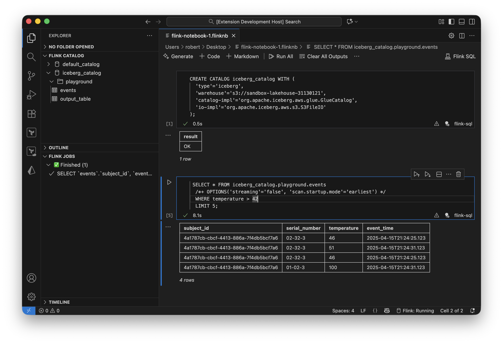

# Flink Notebooks

⚠️ Disclaimer: Alpha Software - expect breaking changes and bugs.

This work is heavily influenced by the amazing talk by [Ryan van Huuksloot](https://www.linkedin.com/in/ryanvanhuuksloot/) at Flink Forward 2025 ( Democratizing Flink SQL ) - I will link the talk as soon as I hear that it went live. 

A VSCode extension providing a Jupyter-like experience for authoring and running Flink SQL queries. 



## Features

- **Interactive Notebooks**: Write and execute Flink SQL in notebook cells with rich formatting
- **No Docker Required**: Uses Flink MiniCluster running in a local Java process
- **Streaming Results**: Watch query results stream into cells in real-time
- **AWS Glue Catalog**: Browse databases and tables, insert references with one click
- **Local Development**: Everything runs on your machine - no cloud resources needed


## Requirements

- **Node.js** 18+ (for VSCode extension)
- **Java** 11+ (to run Flink MiniCluster)
- **AWS CLI** (optional, for Glue Catalog Integration)


## Quick Start

If using Nix and direnv: 

Run `direnv allow` it will install all required dependencies.

Else:

See [SETUP.md](SETUP.md) for detailed setup instructions.

**TL;DR:**

```bash
# 1. Build Flink runtime
cd flink-runtime && ./gradlew shadowJar && cd ..

# 2. Build extension
cd vscode-extension && npm install && npm run compile && cd ..

# 3. Open VSCode and run the extension in development mode
```

## Usage

### Creating Notebooks

1. Open Command Palette: `Cmd+Shift+P` / `Ctrl+Shift+P`
2. Run: **Flink: New Flink Notebook**
3. Write SQL in cells and execute with `Shift+Enter`

### Managing Cluster

- **Start**: `Flink: Start Local Cluster`
- **Stop**: `Flink: Stop Local Cluster`
- **Status**: Click `Flink` in status bar

### Using Glue Catalog

1. Configure AWS credentials (via `~/.aws/credentials` or environment)
2. Set region in settings: `flink-notebooks.awsRegion`
3. Open **Flink Catalog** tree view in Explorer sidebar
4. Browse databases and tables
5. Right-click table → **Insert Table Reference**

## Configuration

### Extension Settings

Very much WIP!!

| Setting | Default | Description |
|---------|---------|-------------|
| `flink-notebooks.gatewayPort` | `8083` | SQL Gateway REST API port |
| `flink-notebooks.miniclusterJarPath` | (empty) | Path to MiniCluster JAR (auto-detected if empty) |
| `flink-notebooks.javaPath` | (empty) | Path to Java executable |
| `flink-notebooks.jvmMemory` | `1024m` | JVM heap size for MiniCluster |
| `flink-notebooks.parallelism` | `2` | Default parallelism level |
| `flink-notebooks.taskSlots` | `2` | Task slots per TaskManager |
| `flink-notebooks.awsProfile` | (empty) | AWS profile name |
| `flink-notebooks.awsRegion` | `us-east-1` | AWS region for Glue |
| `flink-notebooks.autoStartCluster` | `true` | Auto-start cluster on notebook open |

## Troubleshooting

See [SETUP.md#troubleshooting](SETUP.md#troubleshooting) for common issues and solutions.

**Quick fixes:**

- **Cluster won't start**: Verify Java 11+ is installed and JAR is built (`./gradlew shadowJar`)
- **JAR not found**: Rebuild with `cd flink-runtime && ./gradlew shadowJar`
- **No Glue catalog**: Configure AWS credentials with `aws configure`


**Future Enhancements:**

- Remote cluster support (connect to existing Flink)
- Additional catalogs (Hive, custom)
- Query history and saved queries
- Export results (CSV, Parquet, JSON)
- UDF support
- Sideloading JARs 


## Acknowledgments

Built with:

- [Apache Flink](https://flink.apache.org/)
- [VSCode Extension API](https://code.visualstudio.com/api)
- [AWS SDK for JavaScript](https://aws.amazon.com/sdk-for-javascript/)
